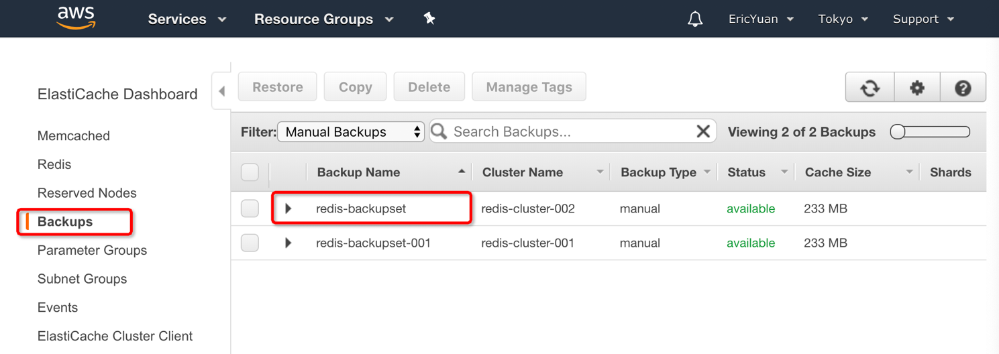

# Migrate data from AWS ElastiCache Redis to Alibaba Cloud Redis

## Summary
1. [Introduction](#introduction)
2. [Backup and export data from AWS Elasticache Redis to S3 Bucket](#backup-and-export-data-from-aws-elasticache-redis-to-s3-bucket)
3. [Restore RDB file to ApsaraDB for Redis instance](#restore-rdb-file-to-apsaradb-for-redis-instance)
4. [Conclusion](#conclusion)
5. [Further Reading](#further-reading)
6. [Support](#support)

## Introduction
In this document, we introduce a method for migrating data from 
[AWS Elasticache Redis](https://aws.amazon.com/elasticache/redis/) to
[Alibaba Cloud for Redis](https://www.alibabacloud.com/product/apsaradb-for-redis). The current
[Alibaba Cloud DTS service](https://www.alibabacloud.com/product/data-transmission-service) normally supports
migrating data from Redis, but unfortunately this is not possible from AWS, because the sync/psync commands are
disabled. This document provides a workaround for this technical problem.

**Note**:

-   This solution requires some business downtime, please plan accordingly.

-   If the Redis instance to migrate is managed by you on your servers, we recommend to migrate data with
    [Alibaba Cloud DTS service](https://www.alibabacloud.com/product/data-transmission-service).

The overall network architecture is as follows:


This technical solution includes the following main steps:

-   Stop applications that write data into the AWS Elasticache Redis instance.

-   Make a backup of the data from AWS Elasticache Redis.

-   Export that backup to an AWS S3 bucket, that will produce a RDB file.

-   Transfer the RDB file to an Alibaba Cloud ECS instance.

-   Restore the RDB file to a ApsaraDB for Redis instance by using [redis-port](https://github.com/CodisLabs/redis-port).

## Backup and export data from AWS Elasticache Redis to S3 Bucket
The following operations are performed on AWS.

-   Stop writing data into the AWS Elasticache Redis instance.

-   Create a **backup** of your cluster:

    

    After it is completed, you can find it in the **Backups** page:

    

    > Note: you can learn more about how to make manual backups by reading
    > [this documentation](https://docs.aws.amazon.com/AmazonElastiCache/latest/red-ug/backups-manual.html).

-   **Export** the backup to an AWS S3 bucket:

    

    After clicking on the **Copy** button, the export process starts:

    

    You can find the exported files in your S3 bucket:

    

    > Note: to learn more about exporting backups, please look at
    > [this documentation](https://docs.aws.amazon.com/AmazonElastiCache/latest/red-ug/backups-exporting.html).

-   Download the RDB file and upload it to an Alibaba Cloud ECS instance.

    -   Download the RDB file from your S3 bucket.

    -   Upload the RDB file to your Alibaba Cloud ECS instance via
        [SFTP](https://en.wikipedia.org/wiki/SSH_File_Transfer_Protocol) (save it on the disk).

## Restore RDB file to ApsaraDB for Redis instance
-   Download redis-port tool:

    ```bash
    wget http://docs-aliyun.cn-hangzhou.oss.aliyun-inc.com/assets/attach/85829/cn_zh/1533199526614/redis-port%282%29
    ```

-   Restore rdb file to ApsaraDB for Redis instance:

    ```bash
    nohup ./redis-port restore \
        --ncpu=4 \
        --parallel=16 \
        --input=/root/redis-*****-0001.rdb \
        --target=r-6w*****b4.redis.japan.rds.aliyuncs.com:6379 \
        --auth=3*****M \
        --rewrite &
    ```

    You can find option description from [README of redis-port](https://github.com/CodisLabs/redis-port/blob/redis-4.x-cgo/README.md).

-   View the restore log records:

    ```bash
    cat nohup.out
    ```
    ```
    2018/12/12 17:59:46 [INFO] set ncpu = 4, parallel = 16 filterdb = 0 targetdb = -1
    2018/12/12 17:59:46 [INFO] set ncpu = 4, parallel = 16 filterdb = 0 targetdb = -1
    2018/12/12 17:59:46 [INFO] restore from '/root/redis-*****-0001.rdb' to 'r-6w*****b4.redis.japan.rds.aliyuncs.com:6379'
    2018/12/12 17:59:46 [INFO] Aux information key:redis-ver value:3.2.10
    2018/12/12 17:59:46 [INFO] Aux information key:redis-bits value:64
    2018/12/12 17:59:46 [INFO] Aux information key:ctime value:1544608041
    2018/12/12 17:59:46 [INFO] Aux information key:used-mem value:244890896
    2018/12/12 17:59:46 [INFO] db_size:437976 expire_size:0
    2018/12/12 17:59:47 [INFO] total = 122286452 - 9357881 [ 7%] entry=32756
    2018/12/12 17:59:48 [INFO] total = 122286452 - 18662514 [ 15%] entry=66288
    2018/12/12 17:59:49 [INFO] total = 122286452 - 27752788 [ 22%] entry=99276
    2018/12/12 17:59:50 [INFO] total = 122286452 - 37372590 [ 30%] entry=133868
    2018/12/12 17:59:51 [INFO] total = 122286452 - 46389965 [ 37%] entry=164759
    2018/12/12 17:59:52 [INFO] total = 122286452 - 55926014 [ 45%] entry=199223
    2018/12/12 17:59:53 [INFO] total = 122286452 - 65357538 [ 53%] entry=233143
    2018/12/12 17:59:54 [INFO] total = 122286452 - 74688625 [ 61%] entry=267014
    2018/12/12 17:59:55 [INFO] total = 122286452 - 83164536 [ 68%] entry=295837
    2018/12/12 17:59:56 [INFO] total = 122286452 - 92365997 [ 75%] entry=329300
    2018/12/12 17:59:57 [INFO] total = 122286452 - 102081024 [ 83%] entry=364418
    2018/12/12 17:59:58 [INFO] total = 122286452 - 111328898 [ 91%] entry=397830
    2018/12/12 17:59:59 [INFO] total = 122286452 - 120745972 [ 98%] entry=431922
    2018/12/12 18:00:00 [INFO] total = 122286452 - 122286452 [100%] entry=437976
    2018/12/12 18:00:00 [INFO] restore: rdb done*
    ```
-   Check the result:

    From redis-port log records, we can find *437976* keys has been imported
    into ApsaraDB for Redis instance.

    And we can check in the source instance which is located in AWS Eleasticache
    Redis instance via client tool **redis-cli**:
    
    ```
    redis-cluster.*****.ng.0001.apne1.cache.amazonaws.com:6379\> info keyspace
    # Keyspace
    db1:keys=437976,expires=0,avg_ttl=0
    ```
    
    You can also access Redis instance by GUI client tool, such as screenshot of
    **RedisDesktopManager** for accessing AWS Elasticache Redis instance:

    

    Alibaba Cloud DMS console for Redis screenshot, you can find the Keys number
    is as same as it in AWS:

    

    

    Search some information to verify the data:

    

-   Make a plan to perform service traffic switchover to ApsaraDB for Redis instance.

>   Skip

## Conclusion
From the case above, it’s possible to migrate data from AWS Elasticache
Redis to Alibaba ApsaraDB for Redis instance.

## Further Reading
[Document Center \> ApsaraDB for Redis User Guide \> Migrate data](https://www.alibabacloud.com/help/doc-detail/85180.htm)

## Support
Don't hesitate to [contact us](mailto:projectdelivery@alibabacloud.com) if you have questions or remarks.